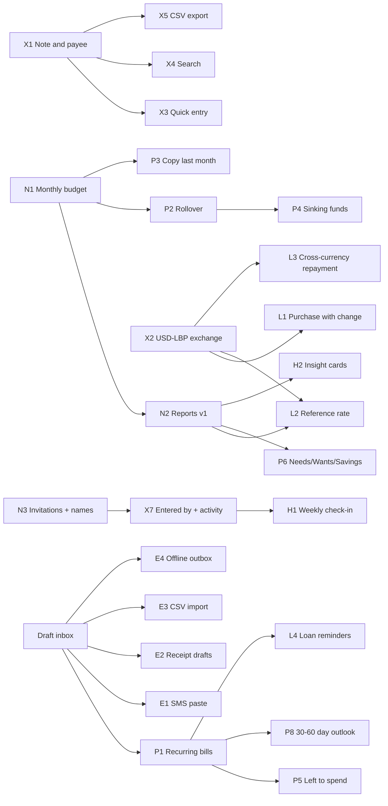

# Competitor research and feature roadmap

## Status

Research and proposal only, prepared on 2026-09-11 against repository commit
`1f80212`. Nothing here is an approved decision or design. An item adopted from
this roadmap still needs its own spec under `docs/superpowers/specs/`, its own
decisions-ledger entry, and the usual database → gateway → UI evidence. Items
that would change an existing decision say so.

**Method.** Five parallel web-research passes on 2026-09-11: guided apps
(Dollarwise and peers), serious budgeting apps, manual multi-currency apps, the
Lebanese/MENA money context, and 2025–2026 market trends and complaints. Plus a
read of this repository's specs, migrations, and decisions ledger. Researchers
used live pages, not recall; anything they could not confirm is marked `?` or
"unverified". Several vendor help centers and Reddit block automated reading, so
some details come from search excerpts or third-party reviews. Prices change
often — treat them as a September 2026 snapshot.

## Summary

- **Budget's position is already unusual.** No app checked combines strict
  two-currency cash wallets, person-to-person loans in both directions, private
  plus household spaces with roles, a household ledger that cannot be silently
  edited, and Arabic/English RTL. YNAB, Monarch, and Copilot are single-currency.
  The multi-currency cash apps (Wallet, Bluecoins, Toshl, Spendee) convert
  silently or share loosely, and none documents RTL.
- **Bank sync is not a gap Budget can close, and that is acceptable.** No
  aggregator covers Lebanon (Lean, Tarabut, Salt Edge with 0 Lebanese banks,
  Plaid). Broken sync is the most common complaint across the category, so the
  job is making manual entry fast.
- **The largest Lebanon-specific opportunity is exchange.** None of the seven
  multi-currency apps records "paid $20, got change in lira" as one event.
  Budget cannot record any USD↔LBP exchange today without inventing income and
  expense, which would distort the designed reports. Exchange should ship before
  the Reports UI.
- **Table stakes Budget lacks:** a note/payee on entries, search, recurring
  bills, export, quick entry (installable app, repeat last), split entries, and
  the designed-but-unbuilt monthly budget and reports.
- **Borrow mechanics, not whole products:** Dollarwise's editable
  Needs/Wants/Savings lens and "safe to spend"; YNAB's who-changed-what feed and
  its 2-of-3 payee memory; Actual's confirm-to-post schedules and cash
  reconciliation; Lunch Money's per-entry rates; Monarch's mine/theirs/ours
  labels.
- **Defer AI.** Assistants are "helpful but rarely used" in reviews and attract an
  "unwanted AI" complaint cluster; automatic categorization solves a problem only
  bank-synced apps have. The one AI idea worth a prototype is bilingual quick
  entry that drafts an entry for a person to confirm.

**Suggested next five milestones, in order** (codes refer to section 8):

1. N1 — Monthly budget, from the existing spec.
2. X1 — Note and payee on entries.
3. X2 — USD↔LBP exchange event.
4. N2 — Reports v1, after exchange exists.
5. X3 — Quick entry and payee memory.

## 1. Where Budget stands

### Built and in the application

- Email/password sign-in. Onboarding creates a personal or household space and a
  first USD or LBP wallet; an owner can add more spaces.
- Wallets with derived balances, an immutable paginated journal, four entry
  shapes (opening balance, income, expense, same-currency transfer), and linked
  reversals as the only correction.
- Income and expense categories with one level of subcategories, English and
  Arabic names, archive, and optional categorization of income and expense.
- Loans in both directions ("they owe me" / "I owe them"): opening outstanding
  amount, cash lending and borrowing, partial repayments, due date, note,
  monthly repayment targets, and per-currency summaries.
- Household membership: invitations, owner/member roles, promotion, removal, and
  leaving. Email delivery is built but not configured live.
- English and Arabic with RTL throughout.
- A public frontend-only beta on Cloudflare. Real, irreplaceable data still waits
  for an encrypted off-site backup and a restore fetched from that copy
  (decisions ledger, 2026-09-11).

### Designed, not built

- **Monthly budgeting** — planned income per currency, root expense category
  targets, unallocated/overallocated, loan commitment, revision history
  (`docs/superpowers/specs/2026-09-08-monthly-budgeting-design.md`).
- **Reporting read model** — monthly cash summary, wallet activity, category
  actual versus budget (`docs/superpowers/specs/2026-09-08-reporting-read-model-design.md`).
  The Reports navigation item is disabled.

### Gaps not on any deferred list

| Gap | Evidence in the repository | Why it matters |
| --- | --- | --- |
| No note, description, or payee on financial events | `financial_events` has no text column; only `loans.note` exists | Every competitor has one. It blocks search, payee memory, useful export, and SMS or receipt drafts. |
| No cross-currency movement of any kind | The transfer shape requires `v_currency_count = 1` in `supabase/migrations/20260907147000_harden_generic_financial_posting.sql` | Exchanging USD for LBP can only be faked as income plus expense, which pollutes income and spending. |
| No wallet archive command | `wallets.archived_at` exists; there is no `public.archive_wallet` | Closed accounts and emptied cash envelopes stay in every picker. |
| No journal search or filters | The Wallets page offers only "older" pagination | "The generator payment in March" cannot be found. |
| No export | No export path exists | Portability and trust; losing history is a top-10 complaint. |
| Not installable | No web manifest or service worker | Home-screen quick entry, and the prerequisite for share target and offline. |
| Member identities are opaque IDs | Household UI decision, 2026-09-10 | "Who entered this?" cannot be shown. |

### Already deferred by existing specs

Refunds, exchanges, savings, assets, contributions, interest, fees,
installments, forgiveness, reminders, cross-currency settlement, recurring or
scheduled entries, imports, offline sync, forecasting, bank sync, split entries,
category icons and colors, automatic categorization, starter category packs,
carry-forward, copying a prior month, and member profiles.

## 2. Apps compared

| App | Kind | Price (Sept 2026) | Mechanic worth studying | Top complaint |
| --- | --- | --- | --- | --- |
| Dollarwise | Guided, bank-synced, US | iOS $14.99/mo or $89.99/yr; web $99.99/yr | Weekly swipe review into Needs/Wants/Debt-Savings; split editable per month since v6.4; Safe to Spend; proactive insight cards | Bank connections fail; price; no splits, sharing, or web |
| EveryDollar | Zero-based (Ramsey) | Free manual; Premium $79.99/yr | Paycheck Planning assigns budget lines to pay dates; Funds carry leftovers | Sync is Premium-only; rigid for irregular income |
| PocketGuard | Overspending guard | $74.99/yr | "In My Pocket" leftover number; snowball/avalanche payoff | Sync breaks; thin free tier |
| Rocket Money | Subscription manager | $7–14/mo, pay what you want | "Rowan" AI agent acts on bills (Aug 2026) | Hard to cancel; fees |
| Simplifi | Spending plan | $3.99/mo billed annually (promo) | Available = income − bills − planned − goals; fixed CSV import template | Annual billing only; one extra member |
| YNAB | Zero-based method | $109/yr | "Recent Moves" who-changed-what; payee default changes only when 2 of the last 3 agree; Loan Planner | Price |
| Monarch | All-in-one for couples | $99.99/yr | Flex budgeting; Shared Views (mine/theirs/ours); rollovers | No multi-currency; sync; price |
| Copilot Money | Apple-first AI tracker | $95/yr | To Review inbox; recurring detection | Apple-only; no separate partner logins |
| Lunch Money | Web-first, multi-currency | $60/yr minimum, pay what you want | 160+ currencies converted at each entry's date; recurring items marked matched/overdue/upcoming | Mobile app is secondary |
| Actual Budget | Open-source envelopes | Free, self-hosted | Schedules that auto-post or wait for approval; cash reconciliation with lock; rules | No multi-currency; self-hosting effort |
| Goodbudget | Manual envelopes | Free; $80/yr | Envelopes synced across a couple's phones | One shared login; dated UI |
| Wallet (BudgetBakers) | Manual + sync, multi-currency | Premium from $5.99 | Group sharing for up to 10 with per-member rights; debts with reminders | Sync failures; an EUR account silently became CHF |
| Spendee | Visual, multi-currency | Plus $27.99/yr | Budget alerts at 75% and 90%; daily allowance | No debts; guests can delete any entry |
| Money Lover | Manual, multi-currency | $19.99 lifetime | Debt/loan tab with installments | Cross-currency transfer is two unlinked records |
| Money Manager (Realbyte) | Double-entry | $19.99/yr | Rate editable per entry; carry-over budgets | No sharing |
| Toshl | Currency-centric | Pro $19.99/yr | Historical rates for back-dated entries; gold as a currency | No debts; shared login |
| Bluecoins | Offline power app | Free; $15.99 once | Rate stored on every entry; face value vs revalued view (EACR) | No web; crashes |
| Monefy | Minimal quick entry | $59.99 | One-tap entry | A missing rate counts as 1:1 |
| Wafeer (Saudi Arabia) | Arabic SMS parser | Paid tier | Bank SMS become entries; iOS users paste | — |
| Riyalak (Saudi Arabia) | Arabic manual tracker | — | Owed and receivable amounts with due reminders | — |
| Masarif | Arabic offline (Android) | — | Full Arabic RTL, debts, savings vaults | — |
| Hakbah / MoneyFellows | Digital savings circles (KSA / Egypt) | — | Rotating payouts; demand peaks before Ramadan, Eid, and September | — |

## 3. Feature comparison

Legend: ● yes · ◐ partial or limited · ○ no · `?` not verified by this research.

| Capability | Budget | Dollarwise | EveryDollar | YNAB | Monarch | Lunch Money | Actual | Wallet | Bluecoins |
| --- | --- | --- | --- | --- | --- | --- | --- | --- | --- |
| Works fully without bank sync | ● | ? | ● free tier | ● | ◐ manual accounts | ● | ● | ● | ● |
| Bank sync | ○ not in Lebanon | ● Plaid | ◐ Premium | ◐ US/CA | ● | ● | ◐ EU/NA/BR/NZ | ● | ◐ SMS/notifications |
| Web app | ● | ○ | ? | ● | ● | ● web-first | ● | ● | ○ |
| Import / export | ○ | ? | ? | ● | ● | ● | ● | ● | ● |
| Offline use | ○ | ? | ? | ? | ? | ? | ● local-first | ? | ● |
| More than one currency | ◐ USD + LBP | ? | ? | ○ one per plan | ○ | ● 160+ | ○ | ● | ● |
| Rate kept on each entry | ○ | ? | ? | ○ | ○ | ● dated rate | ○ | ◐ custom rate | ● |
| Pay in one currency, change in the other | ○ | ? | ? | ○ | ○ | ? | ○ | ○ two records | ◐ split rows |
| Arabic interface | ● RTL | ? | ? | ? | ? | ? | ? | ◐ RTL unverified | ◐ RTL unverified |
| Note / payee on an entry | ○ loans only | ? | ? | ● | ● | ● | ● | ? | ? |
| Split one entry | ○ | ○ "coming" | ● | ● | ● | ● | ● | ? | ● |
| Rules / payee memory | ○ | ● | ◐ automatic | ● 2 of 3 | ● | ● | ● | ? | ? |
| Receipts / attachments | ○ | ? | ? | ● | ● scan | ? | ? | ◐ | ● |
| Recurring / scheduled | ○ | ? | ? | ● | ● | ● status | ● approve | ● | ? |
| Monthly category budget | ◐ designed | ● 50/30/20 | ● zero-based | ● | ● flex | ● | ● envelopes | ● | ● |
| "Left to spend" number | ◐ designed | ● | ● by pay date | ● | ● | ◐ pool | ● | ? | ? |
| Rollover | ○ by decision | ? | ● Funds | ● | ● | ● opt-in | ● | ? | ● |
| Savings goals | ○ | ● | ● | ● | ● | ○ | ◐ templates | ● | ? |
| Person-to-person loans | ● both ways | ? | ◐ debt plan | ◐ bank loans | ◐ pay-down | ? | ○ roadmap | ● | ◐ receivables |
| Reports | ○ designed | ◐ insights | ● | ● | ● | ● | ● | ? | ● |
| Forecasting | ○ | ? | ◐ | ? | ● | ○ thin | ◐ | ? | ◐ |
| Net worth | ○ | ? | ● | ● | ● | ◐ crypto | ? | ? | ● |
| Separate logins in one household | ● roles | ○ | ● spouse | ● up to 6 | ● | ● unlimited | ◐ shared file | ● up to 10 | ◐ cloud folder |
| See who entered what | ◐ stored, not shown | ? | ? | ● | ◐ owner labels | ● | ○ | ? | ? |
| AI assistant | ○ | ◐ insight cards | ○ coaching | ○ | ● | ○ | ○ | ? | ? |
| Price | private beta | $89.99–99.99/yr | free · $79.99/yr | $109/yr | $99.99/yr | ≥$60/yr | free | from $5.99 | free · $15.99 once |

## 4. What Budget already does better

- **Two currencies without silent conversion.** Monefy counts a missing rate as
  1:1, a Wallet user's EUR account became CHF, and Monarch shows everything as
  "$". Budget stores exact minor units per currency (USD cents, LBP whole
  pounds) and never adds them together.
- **Family loans as a real ledger.** Spendee, Toshl, Actual, and Copilot have no
  debt feature; YNAB and Monarch model bank debt. In 2022/23, 58% of Lebanese
  households sought help from relatives or friends and 68% used informal sources
  (World Bank).
- **A household record nobody can quietly rewrite.** Corrections are reversals
  and every event records its actor. Spendee lets any guest delete any entry;
  Goodbudget and Copilot share one login.
- **Private and household spaces with roles.** Rocket Money and Simplifi cap
  sharing at two people; Monarch still cannot budget separately per person.
- **Arabic and English with RTL.** Among the multi-currency apps, only Wallet,
  Money Lover, and Bluecoins list Arabic and none documents RTL. No Lebanese
  USD/LBP household budgeting app could be verified.
- **No bank logins.** Sync failures and re-logins are the leading complaint (50+
  signals in RightIdea's July 2026 analysis), and bank-data costs drive
  subscription prices.

## 5. What users complain about

| Complaint | Evidence | What it means for Budget |
| --- | --- | --- |
| Bank sync breaks and needs re-login | RightIdea 50+ signals; Hacker News; a 4-year Monarch user | Not applicable; say "no bank logins" plainly |
| Price and price hikes | RightIdea 60+ signals; YNAB $109/yr | If Budget goes public, keep manual entry free |
| Redesigns break familiar workflows | RightIdea 80+ signals | Keep the entry flow stable; change additively |
| Basics behind paywalls | Splitwise daily entry cap; Rocket Money 2 free categories | — |
| Wrong categories and shifting rules | YNAB changed its payee logic in Aug 2026 | Payee memory must be predictable, visible, and overridable |
| Manual-entry fatigue | NerdWallet reviews of manual free tiers | Quick entry is the top investment |
| Couples and household friction | Ipsos/BMO: 34% say money causes conflict, 36% admit dishonesty | Who-entered-what, ownership labels, a review ritual |
| Shutdowns and lost history | Mint, Zeta | Export at any time |
| Dark patterns | Cleo's $17M FTC settlement | No card-required trials; easy cancellation |
| Unwanted AI and privacy unease | RightIdea 15–20 signals | AI opt-in, drafts only |

## 6. Lebanese reality the roadmap must respect

- **Rate.** Official 89,500 LBP/USD since early 2024, holding through the 2026
  war (The Media Line, June 2026); street average 89,600 on 2026-09-11
  (lira-rate.com). Stable, yet a rate must still be a fact of one entry, never a
  constant.
- **Cash economy.** About 46% of GDP in 2022 (World Bank); "near-complete
  dollarization of consumer prices" in 2025. Change is often given in LBP because
  small dollar notes are scarce.
- **War.** Fighting resumed on 2 March 2026 with a ceasefire since 16 April. The
  World Bank projects −6.4% GDP and 17.5% inflation for 2026: volatile incomes,
  displacement, and more household support between relatives.
- **Rails.** Whish Money, OMT Pay, and BOB Finance hold USD and LBP with in-app
  exchange but document no export or API. Byblos, BLOM, Fransabank, and BBAC send
  SMS alerts. There is no open-banking framework and no aggregator coverage.
- **Locked deposits.** Circulars 158/166 allow monthly withdrawals ($1,000 and
  $500 from December 2025); the deposit "gap law" was pending in parliament in May
  2026.
- **Costs specific to Lebanon.** Generator subscription (fixed amperage fee plus a
  monthly ministry kWh tariff, LL 49,395/kWh in April 2026), EDL electricity,
  water trucks ($10–22 per 2,000 L), private school fees in fresh dollars, and
  more than $300 of supplies per child.
- **Remittances.** $5.8–6.8B in 2024, arriving mainly as cash or through transfer
  companies; 14% of households receive them.
- **Regional demand signals.** SMS parsing with iOS paste (Wafeer), owed and
  receivable reminders (Riyalak), offline Arabic (Masarif), and digital savings
  circles (Hakbah 2M+ users, MoneyFellows 8.5M+).

## 7. Guardrails every roadmap item inherits

1. **Drafts are intent; postings are money.** Recurring bills, pasted SMS,
   scanned receipts, imports, and offline entries create a non-posting draft,
   append-only like plan revisions. Confirming a draft calls an existing protected
   command with the draft's request UUID. One draft inbox serves all five.
2. **A new event kind is a full-stack change.** Exchange, cash-count adjustment,
   refund, and loan write-off each extend the report classification matrix, the
   enum ratchet, reversal rules, and the financial command inventory in the same
   milestone.
3. **Descriptive metadata attaches beside the event.** Note, payee, tags, and
   attachments use immutable association tables, as Categories v1 did, so the
   verified posting signatures do not change.
4. **A rate belongs to one event.** It is derived from the two real amounts, not
   global state. Any combined total states the rate and date it used; the default
   view stays per currency.
5. **USD and LBP stay separate** in budgets, targets, rollovers, alerts, and "left
   to spend".
6. **Nothing posts itself.** No reminder, schedule, or suggestion becomes a
   posting until a member confirms it.

## 8. Roadmap

Sizes: **S** is a bounded read or UI on existing commands; **M** is a new table or
command plus UI; **L** is a new event kind that touches reversals, reports, and
loans. Rows are in recommended order within each horizon.

### Now — finish the designed core

| # | Item | Borrowed from / evidence | Depends on | Size |
| --- | --- | --- | --- | --- |
| N1 | Monthly budget, from the existing spec. Lead with one "left to allocate" figure per currency. | Dollarwise Safe to Spend; Simplifi Available; YNAB Ready to Assign | — | L (specified) |
| N2 | Reports v1, from the existing spec: this month versus last per currency, wallet activity, category actual versus budget with subcategory roll-up. | Table stakes everywhere | N1 for budget columns | L (specified) |
| N3 | Live invitation delivery plus member display names. | YNAB Together; Lunch Money collaborators | Provider approval; identity projection design | M |

Gate: an encrypted off-site backup and a restore from that copy before
irreplaceable data.

### Next — fast, trustworthy daily entry

| # | Item | Borrowed from / evidence | Depends on | Size |
| --- | --- | --- | --- | --- |
| X1 | Note and payee on entries. | Every competitor | — | M |
| X2 | USD↔LBP exchange as one linked event: an outflow, an inflow, the rate derived from both amounts and stored on the event, its own report buckets, reversible. | Lunch Money dated rates; Bluecoins rate per entry; missing in all seven multi-currency apps | — | L — before the Reports UI ships |
| X3 | Quick entry: installable web app, "repeat as new", remembered wallet and category, payee → category suggestion that changes only when 2 of the last 3 agree. | YNAB widgets and payee rule; PocketGuard duplicate; Spendee widget | X1 | M |
| X4 | Journal search and filters (text, dates, wallet, category, amount) as a bounded read. | Table stakes; Honeydue criticised for lacking search | X1 | M |
| X5 | CSV export per space. | Shutdown and lost-history complaints; Simplifi; Bluecoins | X1 | S |
| X6 | Archive a wallet. | Column already exists | — | S |
| X7 | "Entered by" on every entry and a household activity feed. | YNAB Recent Moves; Lunch Money "Linked by" | N3 | M |
| X8 | Optional bilingual Lebanese household category pack: generator subscription, EDL, water delivery, school fees, phone recharge, parent support, remittance received. | Local cost structure; the ledger requires its own opt-in pack policy | — | S |

### Later — Lebanon-native money

| # | Item | Borrowed from / evidence | Depends on | Size |
| --- | --- | --- | --- | --- |
| L1 | Purchase paid in one currency with change in the other, as one event (exchange legs plus expense). | No app checked supports it | X2 | L |
| L2 | Household reference rate: dated, append-only, prefilled at 89,500, a suggestion only. Optional "converted at R on D" report view; face value by default. | Toshl suggested rate; Bluecoins EACR; Monefy 1:1 anti-pattern | X2, N2 | M |
| L3 | Repay a loan from a wallet in the other currency. | Deferred "cross-currency settlement" | X2 | M |
| L4 | Loan upgrades: per-person totals, due and overdue states then reminders, projected payoff date from the monthly target, forgive/write-off event, installment schedule. | Riyalak; Wallet; Money Lover; YNAB Loan Planner; PocketGuard snowball | Reminders need P1 | M each |
| L5 | Cash count: enter what is in the wallet; the difference posts as an explicit adjustment event. | Actual reconciliation | — | M |

### Later — planning depth, after a few real months of budgeting

| # | Item | Borrowed from / evidence | Depends on | Size |
| --- | --- | --- | --- | --- |
| P1 | Recurring bills that propose a draft (upcoming → due → confirmed, skipped, or overdue); confirming posts through the protected command. | Actual approval mode; Lunch Money statuses; table stakes | Draft inbox (guardrail 1) | L |
| P2 | Rollover per category and currency: opt-in leftover carry; overspending reduces next month's unallocated. Changes the current "no automatic carry-forward" decision. | Actual; YNAB; Monarch; Copilot | N1 | M |
| P3 | Copy last month's plan. | Deferred "bulk month copy" | N1 | S |
| P4 | Sinking funds and savings goals: an amount by a date becomes a monthly target (September school fees, insurance, Eid). | EveryDollar Funds; Actual templates; Monarch goals | N1, P2 | M |
| P5 | "Left to spend" with a daily allowance, after scheduled bills. | PocketGuard; Simplifi; Spendee | N1, P1 | S |
| P6 | Needs / Wants / Savings lens: tag each root category once; an editable split per month and currency. | Dollarwise v6.4 | N1, N2 | S |
| P7 | Split one entry across categories. | EveryDollar; YNAB; Monarch; Bluecoins; Dollarwise's most requested gap | Allocation contract | L |
| P8 | 30–60 day outlook from scheduled bills and loan targets; long-range forecasting stays out. | Market-trend research | P1 | M |
| P9 | Pay-date planning: assign budget lines to income dates. Validate first. | EveryDollar Paycheck Planning | N1 | M |

### Later — household rituals and insight

| # | Item | Borrowed from / evidence | Depends on | Size |
| --- | --- | --- | --- | --- |
| H1 | Weekly check-in: other members' entries since your last visit, uncategorized entries, overspent categories, bills and loans due. Acknowledge only; nothing edits the journal. | Dollarwise weekly review; Copilot To Review; Monarch weekly recap | X7, N2 | M |
| H2 | Plain insight cards from the journal: change versus last week, 75%/90% pace, due soon. | Dollarwise insight cards; Spendee alerts | N2 | M |
| H3 | Mine / theirs / ours label on wallets, inherited by entries; filter reports by member. | Monarch Shared Views | N2 | M |
| H4 | Hide-amounts toggle. | YNAB (June 2026); Spendee | — | S |
| H5 | Monthly recap email. | Existing Resend delivery boundary | N3, N2 | S |

### Explore — validate before designing

| # | Idea | What must be learned first |
| --- | --- | --- |
| E1 | Paste a bank or wallet SMS to create a draft | Real Lebanese SMS samples. Web apps cannot read SMS; the share target works on Android Chrome but not iOS Safari. |
| E2 | Receipt photo to a draft through a vision model | A privacy decision about sending images out. Vision models beat classic OCR on Arabic, but numbers are the weak spot. Start with a plain attachment. |
| E3 | CSV import into drafts with a fixed template | Whether anyone has files to import; Lebanese wallets document no export. |
| E4 | Offline entry outbox | iOS storage eviction behaviour. Request UUIDs are already idempotent and effective dates already separate from server time. |
| E5 | Bilingual natural-language quick add, drafted for confirmation | Time-to-entry measured against the quick-entry form. |
| E6 | Savings-circle (jam'iyya) tracker on the loans ledger | Lebanese demand (unverified). |
| E7 | Assets and net worth, including gold in grams, locked deposits as non-spendable, and an opt-in zakat estimate | Whether locked deposits still matter to users; the deferred assets design. |
| E8 | Settle-up between household members per currency | Demand; overlap with loans. |
| E9 | Pricing model if Budget becomes public | Whether it becomes public at all. |

### Won't do, for now

- **Bank sync or open banking** — no provider covers Lebanon.
- **A live rate feed as the source of truth**, or combined totals without a stated
  rate.
- **Editing or deleting posted entries**, or shared logins.
- **An AI chat assistant or an agent that acts on accounts.**
- **Machine-learned automatic categorization.**
- **Age of Money** — first-in-first-out per currency for little value.
- **Streaks and gamification** — only vendor evidence.
- **Long-range forecasting, investment tracking, bill negotiation.**

## 9. Dependency map

## 10. Worked example: paying in dollars, change in lira

A supermarket bill of LL 1,340,000 is paid with a $20 note and LL 450,000 comes
back as change (L1).

| Leg | Wallet | Currency | Amount (minor units) | Reported as |
| --- | --- | --- | ---: | --- |
| Exchange out | USD cash | USD | −2000 | Exchange, not spending |
| Exchange in | LBP cash | LBP | +1790000 | Exchange, not income |
| Purchase | LBP cash | LBP | −1340000 | Expense · Groceries |

- **Wallet effect:** USD cash −$20.00; LBP cash +LL 450,000.
- **Rate stored on the event:** 1,790,000 ÷ 20.00 = 89,500 LBP per USD.
- **Priced in dollars instead** ($15, change LL 447,500): USD −1500 expense,
  USD −500 exchange out, LBP +447500 exchange in.

Whether legs may share a wallet-movement row is a design question. The
invariant is that the expense and the exchange are classified separately and
reconcile exactly to the two wallet deltas.

## 11. Questions that would change this roadmap

1. Is Budget staying a private family tool, or becoming a product for Lebanese
   households? A public product moves onboarding packs, import, pricing, and
   support up.
2. Should exchange (X2) ship before the Reports UI? Recommended: yes.
3. Should opt-in rollover (P2) replace "no automatic carry-forward"?
4. Do household members need a view-only or entry-only role?
5. May receipt images or SMS text be sent to an external AI model for drafting?
6. Are locked bank deposits still part of the households Budget serves?

## Sources

Retrieved 2026-09-11 unless noted. Vendor pages describe their own products.

**Dollarwise and guided apps**
- [Dollarwise](https://dollarwise.com/) · [App Store listing and version history](https://apps.apple.com/us/app/dollarwise-budget-tracking/id6739215932) · [The College Investor review](https://thecollegeinvestor.com/78667/dollarwise-review/)
- [EveryDollar relaunch](https://finance.yahoo.com/news/ramsey-solutions-relaunches-everydollar-help-130000866.html) · [Paycheck Planning](https://everydollar.help.ramseysolutions.com/hc/en-us/articles/11667520933773-Paycheck-Planning) · [Penny Hoarder review](https://www.thepennyhoarder.com/budgeting/everydollar-app-review/)
- [PocketGuard review](https://www.thepennyhoarder.com/budgeting/pocketguard-review/) · [Rocket Money Premium](https://help.rocketmoney.com/en/articles/2677184-premium-membership-features) · [Rowan announcement](https://www.prnewswire.com/news-releases/rocket-moneys-rowan-rewrites-what-ai-can-do-in-personal-finance-302859522.html)
- [Simplifi Spending Plan](https://support.simplifi.quicken.com/en/articles/4212702-understanding-your-spending-plan) · [Simplifi CSV import](https://support.simplifi.quicken.com/en/articles/4413430-how-to-manually-import-transactions) · [Quicken Assist](https://www.quicken.com/blog/what-is-quicken-assist-the-new-ai-chat-in-quicken-simplifi/)

**Serious budgeting apps**
- [YNAB pricing](https://www.ynab.com/pricing) · [YNAB what's new](https://www.ynab.com/whats-new) · [YNAB multiple currencies](https://support.ynab.com/en_us/using-multiple-currencies-in-ynab-a-guide-SyBF6PHno) · [YNAB Together](https://www.ynab.com/features/subscription-sharing) · [Loan Planner](https://www.ynab.com/blog/ynab-loan-planner)
- [Monarch flex budgeting](https://www.monarch.com/blog/flex-budgeting-simplify-your-spending-with-just-one-number) · [Shared Views](https://www.monarch.com/blog/shared-views) · [Winter release](https://www.monarch.com/blog/winter-release) · [Monarch review](https://www.thepennyhoarder.com/budgeting/monarch-money-review/)
- [Copilot rollovers](https://help.copilot.money/en/articles/3790828-budget-rollovers) · [Copilot recurrings](https://help.copilot.money/en/articles/9778259-recurrings-tab-overview) · [Copilot partner sharing](https://help.copilot.money/en/articles/4523792-sharing-your-account-with-a-partner)
- [Lunch Money multicurrency](https://support.lunchmoney.app/settings/multicurrency) · [Recurring items](https://support.lunchmoney.app/finances/recurring-items/the-basics-of-recurring) · [Rules](https://support.lunchmoney.app/setup/rules) · [Collaborators](https://support.lunchmoney.app/settings/collaborators)
- [Actual budgeting](https://actualbudget.org/docs/budgeting/) · [Schedules](https://actualbudget.org/docs/schedules) · [Reconciliation](https://actualbudget.org/docs/accounts/reconciliation) · [Multi-currency](https://actualbudget.org/docs/budgeting/multi-currency/) · [Roadmap for 2026](https://actualbudget.org/blog/roadmap-for-2026/)
- [Goodbudget sharing](https://goodbudget.com/help/mobile-apps/share-budget-w-partner/) · [Goodbudget plans](https://goodbudget.com/signup)

**Multi-currency cash apps**
- App Store listings: [Wallet](https://apps.apple.com/us/app/wallet-daily-budget-profit/id1032467659) · [Spendee](https://apps.apple.com/us/app/expense-budget-app-spendee/id635861140) · [Money Lover](https://apps.apple.com/us/app/money-lover-money-manager/id486312413) · [Money Manager](https://apps.apple.com/us/app/money-manager-expense-budget/id560481810) · [Toshl](https://apps.apple.com/us/app/toshl-finance-best-budget/id921590251) · [Bluecoins](https://apps.apple.com/us/app/bluecoins-finance-budget/id1590297575) · [Monefy](https://apps.apple.com/us/app/monefy-bills-money-tracker/id1212024409)
- [Wallet group sharing](https://support.budgetbakers.com/hc/en-us/articles/7149394922002-Everything-about-Group-Sharing) · [Spendee shared wallets](https://help.spendee.com/article/224-shared-wallets) · [Toshl currencies](https://toshl.com/blog/currencies-in-toshl-finance-ounces-of-gold-welcome-web-app/) · [Bluecoins multi-currency](https://www.bluecoinsapp.com/guide/multi-currency/) · [Bluecoins EACR](https://www.bluecoinsapp.com/guide/eacr/) · [Monefy help](https://www.monefy.com/help-center)

**Lebanon and MENA**
- [Lebanese pound](https://en.wikipedia.org/wiki/Lebanese_pound) · [BLOMINVEST monthly rates](https://brite.blominvestbank.com/series/Monthly-Average-Exchange-Rates-USD-LBP-3379/) · [The Media Line, June 2026](https://themedialine.org/life-lines/analysis-lebanons-pound-is-holding-its-economy-is-another-story/) · [lira-rate.com](https://www.lira-rate.com/lbprate.php)
- [World Bank, Jan 2026](https://www.worldbank.org/en/news/press-release/2026/01/22/lebanon-economic-rebound-marks-cautious-recovery-amidst-progress-on-reforms) · [World Bank Poverty & Equity Assessment 2024](https://documents1.worldbank.org/curated/en/099052224104516741/pdf/P1766511325da10a71ab6b1ae97816dd20c.pdf) · [Al Jazeera, Aug 2026](https://www.aljazeera.com/news/2026/8/22/world-bank-projects-war-hit-lebanons-economy-to-contract-by-6-4-percent)
- [LCPS on deposit access](https://www.lcps-lebanon.org/en/articles/details/5004/central-bank-circulars-and-deposit-access-in-2025) · [Generator tariff tracker](https://smartioleb.com/generator-tariff-lebanon/) · [Arab Reform Initiative, energy](https://www.arab-reform.net/publication/navigating-the-energy-shock-electricity-and-social-equity-in-lebanon/) · [Remittances](https://www.thebeiruter.com/article/lebanon%E2%80%99s-remittance-lifeline-is-exposed-to-the-middle-east-war/1390)
- [Whish Money FAQ](https://www.whish.money/faq) · [BLOM SMS alerts](https://www.blomretail.com/retail/sms-alerts) · [Salt Edge Lebanon coverage](https://www.saltedge.com/products/account_information/coverage/lb) · [Tarabut](https://startupbahrain.com/blog/tarabut-from-a-bahrain-sandbox-to-gcc-wide-open-finance)
- [Wafeer](https://apps.apple.com/sa/app/id1552797940?l=en) · [Riyalak](https://apps.apple.com/us/app/%D8%B1%D9%8A%D8%A7%D9%84%D9%83-riyalak/id6465422809) · [Masarif](https://masarif.mshru3.com/) · [Hakbah and savings circles](https://www.semafor.com/article/02/03/2026/saudi-traditional-savings-circles-go-digital)
- [KITAB-Bench Arabic OCR](https://arxiv.org/abs/2502.14949) · [PWA share target support](https://raw.githubusercontent.com/mdn/browser-compat-data/main/manifests/webapp/share_target.json) · [Google Play SMS policy](https://support.google.com/googleplay/android-developer/answer/10208820)

**Trends and complaints**
- [RightIdea budget-app complaint analysis, July 2026](https://rightidea.app/research/budget-app) · [NerdWallet best budget apps](https://www.nerdwallet.com/finance/learn/best-budget-apps) · [Hacker News on Mint alternatives](https://news.ycombinator.com/item?id=39275231)
- [Money self-control meta-analysis](https://pmc.ncbi.nlm.nih.gov/articles/PMC8266115/) · [Ipsos/BMO couples and money](https://www.ipsos.com/en-us/money-fights-one-three-34-partnered-americans-identify-money-source-conflict-their-relationship) · [FTC v. Cleo AI](https://www.ftc.gov/legal-library/browse/cases-proceedings/cleo-ai-inc-ftc-v)
