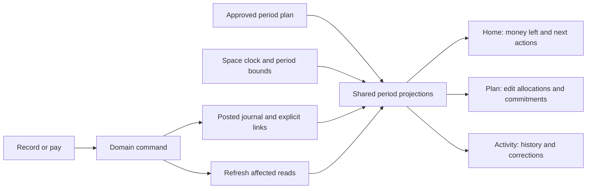

# Connected app review: linking plan, daily use, and rebuild decision

Date: 2026-09-30. Reviewed source: local `main`, HEAD `63704d5`.

## Recommendation

Keep the financial foundation and rework the integration between planning and daily actions. Do not start the whole app over, and do not treat the September 29 linking draft as a complete solution to the user's concern.

The app already has valuable building blocks: protected financial commands, derived wallet and loan balances, exact money helpers, append-only revisions and corrections, request-ID reconciliation, household membership boundaries, typed gateways, bilingual components, and feature tests. Those are expensive to recreate correctly. The remaining problems are largely at the boundaries between these features: which period they mean, which plan version they read, which relationships they preserve, and which screens refresh after an action.

This is an architectural recommendation from repository evidence. It is not a claim that every existing database invariant has passed fresh verification.

## Scope and evidence

The requested `docs/superpowers/plans/2026-09-29-plan-linking-database.md` is absent from this checkout. The closest document is [the September 29 linking and baseline design](../superpowers/specs/2026-09-29-plan-linking-and-clean-baseline-design.md). This review covers that draft and the current implementation, with the September 25 audit used as historical context. Several of that audit's original defects have already been addressed; they should not be repeated as current findings without reading the later code.

Fresh checks:

- `pnpm exec tsc --noEmit`: passed.
- Six selected UI/unit suites: 118 tests passed. Suites covered Control Room routes, allocation setup, onboarding dialog, recurring automatic settlement, goal Buy it, and the Plan client.
- Three additional suites covering unlink settlement, the allocation editor, and goal monthly-target loading: 36 tests passed. Total selected existing checks: 154 tests across nine suites.
- A temporary integration regression test exercised Home → Record → categorized $10 expense → successful save. It failed all three refresh assertions: budget reads remained at 1 rather than 2, trend reads remained at 1 rather than 2, and available-cash reads remained at the initial 2 currency reads rather than 4. The scratch test was removed after the review. This is a reproduced integration defect, not an inference from a comment.

No application code or migration was changed. No live database, deployment, database reset, or external financial data was accessed. Database findings below are traced from the latest function definitions in source, rather than reproduced against PostgreSQL. Existing unrelated working-tree changes were left alone.

## Current findings, in priority order

### 1. P1 — A successful financial action does not refresh every affected view

**Reproduced for ordinary Home expense recording; other paths traced in source.**

Home owns budget/trend reads whose effect depends on clients, space, month, and a retry counter. Its available-cash hooks also have no financial-mutation dependency. Global Record refreshes the wallet hook, but not those Home reads. The screen can therefore mix new balances/activity with old spending and available cash.

Evidence: `src/features/control-room/routes.tsx:241`, `:274`, `:310`, `:1059`.

The opposite direction is incomplete too: a bill confirmation creates a financial event but refreshes recurring state; Buy it records an expense but refreshes goals/detail; loan recording refreshes loans but not the persistent central wallet state. Simply returning to Home does not necessarily repair the wallet snapshot because its hook remains mounted above the destination screens.

Evidence: `src/features/recurring/use-recurring.ts:212`, `src/features/goals/goal-detail.tsx:163`, `src/features/loans/use-loans.ts:128`, `src/features/control-room/routes.tsx:1078`.

Category lists show the same ownership problem: global Record and Manage Categories use separate category hooks; inline creation calls the raw gateway without refreshing the central list. New categories can disappear from the next entry's picker, and archived categories can remain selectable.

Evidence: `src/features/control-room/routes.tsx:844`, `:1086`, `src/features/categories/categories-page.tsx:99`.

**Required change:** give every successful or reconciled command a shared way to invalidate the affected reads. Wallet events affect wallets, journal, budget actuals, allocation actuals, and cash projections; loan commands additionally affect loan reads; settlements affect bills; category changes affect all reference pickers. Do not require each screen to remember a different subset of callbacks.

### 2. P1 — “Unlink payment” reverses the actual money transaction

**Source-traced behavior and product-label defect.**

The bill action labeled “Unlink payment” calls `wallets.reverseEvent`. If an actual $50 expense was linked to the wrong bill, detaching it also cancels the expense and restores $50 to the derived wallet balance. Reversing an event can also affect every other relationship attached to that event.

Evidence: `src/features/recurring/occurrence-detail.tsx:281`, `src/features/recurring/unlink-settlement.ts:10`.

**Required change:** distinguish correcting a bill match from reversing a financial transaction. A settlement-unlink command should change the relationship and reopen the appropriate bill without inventing returned money. A transaction reversal should explicitly explain its financial effect.

### 3. P1 — Loan repayments follow different behavior on different screens

**Source-traced integration defect.**

The central loan hook receives the repayment callback that links a repayment to scheduled debt occurrences. Plan → Loans mounts `LoansPage`, which creates another loan hook without that callback. Repaying there can reduce the loan but leave its scheduled installment unsettled. The persistent central loan and wallet snapshots can also remain stale.

Evidence: `src/features/control-room/routes.tsx:879`, `:796`, `src/features/loans/loans-page.tsx:46`, `src/features/loans/use-loans.ts:148`.

**Required change:** both entry paths must execute the same repayment workflow and publish the same resulting invalidations. Extract reusable actions/state from the legacy page, rather than embedding another complete workspace with its own behavior.

### 4. P1 — Editing a plan does not preserve the existing goal and loan links

**Source-traced defect; publish consequences still need a database regression test.**

The allocation editor initializes every goal's group to `null`, even when the published plan already linked it. Submit sends those null values. The loan group is initialized to the first Future group, rather than the recorded loan mapping. An unrelated edit can consequently detach a goal or move the debt allocation unless the person reconstructs the links manually.

Evidence: `src/features/allocation/allocation-month-editor.tsx:139`, `:273`, `src/features/allocation/allocation-setup.tsx:135`.

The draft's remembered defaults are helpful, but defaults alone do not solve this: an existing period's explicit overrides must survive Edit → Save, and a failed mapping read must not be treated as an intentionally empty mapping.

### 5. P1 — Payday and timezone support are only partly adopted

**Source-traced inconsistency; non-default settings are not yet exposed by ordinary onboarding. Introducing those controls makes this a prerequisite.**

`space_clock.currentMonth` follows the payday period. Home's reporting reads use `space_period_bounds`. However, the monthly Plan summary, allocation state, cash commitments, and available-cash snapshot selection still use calendar-month windows. With payday on the 25th, different cards can count different days or choose different snapshots for the same apparent period.

Evidence: `supabase/migrations/20260929100000_space_payday.sql:63`, `20260929120000_space_period_report_reads.sql:32`, `20260912101000_monthly_budget_planning.sql:145`, `20260916100000_month_transitions.sql:1147`, `20260928100000_space_timezone.sql:159`.

Timezone adoption is also incomplete. The later timezone migration updates cash and occurrence reads, but `confirm_scheduled_occurrence` and `link_scheduled_payment` still derive `v_today` from UTC in their current definitions. After midnight in Beirut, an entry using the screen's space date can be refused by the payment-link command as future-dated.

Evidence: `supabase/migrations/20260914170000_recurring_schedules.sql:834`, `:985`.

Embedded Loans chooses its own UTC month. Goal detail edits the current UTC month rather than the selected Plan period. The allocation goal loader takes amounts from a current-month goal projection and looks up revision heads for the requested month, mixing two contexts.

Evidence: `src/features/loans/loans-page.tsx:47`, `src/features/loans/use-loans.ts:21`, `src/features/goals/goal-detail.tsx:37`, `:111`, `src/features/goals/monthly-target.ts:32`.

**Required change:** one server-owned period contract containing space, timezone, today, period key, start, and exclusive end; pass it through every relevant read and command. Adopt it across the entire calculation graph before enabling non-default payday behavior.

### 6. P1 — Plan and Allocation still expose different authoritative budgets

**Source-traced architectural gap.**

The Plan page edits income and category revisions directly. Allocation publishes a snapshot, and available cash uses that snapshot. Later Plan edits can change Home's budget readings while cash and month transitions use the previously published values. A warning banner acknowledges the drift, but the person still has to understand and repair it.

The same “Left to allocate” label also has different meanings: Plan subtracts category targets and loan commitments; Allocation measures group assignments plus standalone/excess commitments. Assigning all income to groups can give Allocation zero while Plan still reports money left because category-level targets do not exhaust the groups.

Evidence: `src/features/control-room/routes.tsx:680`, `src/features/plan/plan-client.ts:162`, `supabase/migrations/20260912101000_monthly_budget_planning.sql:207`, `20260916100000_month_transitions.sql:1214`, `20260928100000_space_timezone.sql:193`.

**Required change:** one user-facing period plan and one Save operation. Retain immutable revisions for audit, but make the approved plan version the shared reference for Home, groups, categories, goals, debt, cash, copy, and close. If drafts are supported, label them explicitly and show their effect before Save.

### 7. P2 — Daily navigation and dates can get stuck or stale

**Source-traced defects.**

Home builds its month options from the selected month. After moving backward from September to August, September disappears from the options. The app also loads the space clock only during workspace load/space selection; staying open overnight retains yesterday's entry defaults, occurrence window, and cash as-of date.

Evidence: `src/features/control-room/home-screen.tsx:30`, `:275`, `src/features/workspace/use-workspace.ts:105`, `:140`.

**Required change:** use a stable current-period anchor and allow forward/back navigation. Refresh the server clock on resume and date/period boundaries; preserve an intentionally selected historical period while updating today's command defaults.

## What the September 29 draft gets right

It addresses real setup friction: a usable starter plan, category-driven classification, remembered goal/debt defaults, fewer setup questions, one server operation for seeding, and editable defaults. Names already have English/Arabic columns in allocation template lines, so that draft question is answered by the current schema (`20260914110000_allocation_schema.sql:44`).

The draft should be used as input to the next design, but it currently excludes Home integration, duplicate entry screens, and other daily concerns. Those exclusions overlap directly with the user's main problem. Implementing the draft unchanged can improve initial setup while leaving ordinary money actions disconnected.

## Decisions the replacement plan must settle

### Links need a currency and history policy

Categories are space-level identities; allocation groups belong to a currency. A single `category.group_id` cannot express both USD and LBP defaults safely. Prefer defaults keyed by `(space, currency, root category)`, with subcategories inheriting the root's mapping. Goal defaults and the debt default must obey the same space/currency boundaries.

A default change should affect future plan construction. Editing an existing period should explicitly create a new plan version; it should not silently remap previously accepted history. Preserve saved overrides and define what happens when categories/groups/goals are archived.

### “Every amount belongs to one group” needs a precise scope

The draft's slogan is too broad to be a financial invariant. Opening balances, salary receipts, wallet transfers, exchanges, earmarks, purchases, and debt repayments have different meanings.

| Action | Cash effect | Planning treatment |
| --- | --- | --- |
| Opening balance | Establishes existing cash | Does not count as salary or spending |
| Expected salary | None until received | Forecast/plan only |
| Received salary | Increases wallet cash | Funds the plan; a linked schedule must stop forecasting the received part |
| Expense | Decreases wallet cash | Categorized spending, with one applicable group mapping |
| Wallet transfer/exchange | Moves/converts existing money | Does not create ordinary income or spending |
| Reserve money for a goal | No wallet movement by itself | Reserves a claim on existing cash; distinct from a transfer to a savings wallet |
| Buy something using a goal | One expense outflow | Reduces the goal claim; define presentation so saving and later purchase are not presented as duplicate cash expenses |
| Repay borrowed principal | Decreases cash and debt | Debt commitment/actual; distinct from ordinary category spending |
| Correct a bill match | No cash effect | Detaches only the settlement relationship |
| Reverse a transaction | Cancels the original financial effect | Reopens affected commitments and uses the approved correction-date policy |

This table is a proposed product contract, not a new implementation. In particular, investment/savings percentages must not imply investment purchases or real transfers that the application has not recorded.

### Planned, expected, received, reserved, and spendable are different amounts

Prefilling planned income from schedules is useful, but it needs a rule for multiple salaries, irregular income, late/partial receipts, and different paydays. Expected income must never inflate actual wallet cash. Receiving salary must reduce the corresponding unpaid forecast so it is not counted twice.

The current “Available after commitments” subtracts spending budgets as well as bills, goals, and debt. It therefore measures additional unassigned cash. With $1,000 cash fully assigned to a plan, it can correctly show $0 even while the grocery budget still has money to spend. It is not the total amount the person can use for everyday purchases.

Evidence: `src/features/cash-control/cash-control-summary.tsx:62`, `supabase/migrations/20260928100000_space_timezone.sql:247`.

Home should distinguish remaining money within everyday spending budgets, cash reserved for bills/debt/goals, and extra unassigned money. A “safe today” number requires its own defined calculation and shortage/forecast assumptions; do not simply rename the existing extra-cash-per-day field.

### Onboarding must end in a usable state

Seeding group names and categories is insufficient. Completion must establish the actual current period plan, its income assumptions and mappings, and make the daily view usable without a second publishing wizard. Specify category targets versus group budgets, both currencies, optional missing income, initial balances, and recovery from a lost response or an interrupted setup.

For existing users, the accepted preview must preserve their wallets, history, categories, and explicit choices. Idempotency must cover retries and concurrent household setup, not merely calling the happy path twice.

## How I would build the app from scratch

I would keep the present stack and financial principles, then organize the product around complete journeys instead of independent feature workspaces.

The shared model would be a space, its wallets/currencies, one active period context, the posted journal, one approved period-plan version, and explicit links to scheduled obligations and goals. SQL remains responsible for authoritative balances and financial invariants. Small domain commands handle receive income, record expense, pay an obligation, repay a loan, fund/use a goal, and correct a mistake. Related writes that must succeed together belong in one database transaction; retries reuse a request identity. PostgreSQL documents this all-or-nothing transaction behavior in [its transaction guide](https://www.postgresql.org/docs/18/tutorial-transactions.html).

The primary journeys would be:

- **Set up:** starting wallets/balances, income assumptions, payday/timezone, editable default groups, and important bills; finish with a usable plan.
- **Receive money:** record where it arrived, match an expected receipt explicitly or offer a reviewed match, and handle differences from the plan.
- **Use the app today:** see remaining everyday budgets, upcoming/overdue commitments, goal progress, and one clear Record action.
- **Pay a bill or loan:** select the obligation and wallet; post once; reflect it everywhere; allow partial payment and corrections.
- **Save and buy:** distinguish assigning money to a goal from physically moving it; purchases release the appropriate claim without duplicate outflow.
- **Review balances:** compare the journal's derived balances with actual wallet/account balances and explain discrepancies through explicit corrections. A trusted daily app needs a reconciliation journey, not just a balance display.
- **End a period:** review differences, carry permitted amounts, and begin the next plan from defaults/prior choices without rebuilding everything.

Home would answer daily questions. Plan would be the single place to change the plan. Activity would explain what happened and offer precise corrections. Manage would hold wallet/category/household settings. Goals, bills, and loans can retain detail screens, but they should execute the same domain workflows regardless of where the person starts.

## Baseline cleanup should be a separate change

A fresh Supabase database does not require a fresh application architecture. The draft's baseline work reduces migration history; it does not solve disconnected calculations or workflows.

The draft also says to remove unused functions and then prove schema equality against the old history. Those are incompatible acceptance criteria. First create an equivalent baseline preserving the final objects, privileges, policies, triggers, and necessary initialization. Then remove explicitly obsolete objects in a separate migration with dependency and behavior tests. Browser callers alone are not the complete dependency graph: database functions, release verification, and test fixtures also call or require objects.

The live runner currently verifies an exact 61-version journal, and source tests refer to specific historical filenames. These must change as part of a baseline project rather than being discovered only after the old files disappear.

Evidence: `scripts/ops/apply-live-migrations.sh:65`, `tests/ops/live-migrations.test.ts:202`, `tests/db/subcategories-source-ratchet.test.ts:118`.

Supabase's [migration squash documentation](https://supabase.com/docs/reference/cli/supabase-migration-squash) explicitly describes a schema-only result and omitted data manipulation. Schema comparison alone therefore does not establish equivalent initialization. Run behavioral/RLS tests on databases built by both routes, verify required initial data, and update the release/restore verification paths. Assess old development database histories separately from the new empty project.

## Options and recommended order

| Approach | Benefit | Limitation | Assessment |
| --- | --- | --- | --- |
| Implement only the current draft | Better defaults and setup | Leaves refresh, period, correction, and dual-plan problems | Insufficient for the stated concern |
| Keep the foundation and rework integration | Reuses financial safeguards while addressing ordinary use | Requires a clear shared contract and cross-feature tests | Recommended |
| Rewrite the whole app | Freedom to choose a new structure | Rebuilds the same hard financial/security/retry behavior without evidence that the stack is the problem | Not justified by this review |

Recommended delivery sequence:

1. Fix the reproduced refresh defect and centralize command completion/invalidation; repair the repayment entry-path difference, link preservation, and unlink/reversal distinction.
2. Finish the shared space/period/date contract across reads and mutations, including resume/midnight behavior.
3. Establish one approved period plan, currency-aware defaults, snapshot/history policy, and one Save workflow. Use the useful parts of the September 29 draft here.
4. Connect onboarding and Home to that contract, including bills due, setup recovery, and clear explanations of everyday budget remaining versus unassigned cash.
5. Prove the full daily lifecycle against the real database and browser, then perform baseline cleanup as its own reviewable change before the new-project release.

Baseline export can be prepared independently, but removing old migrations/functions should wait for explicit equivalence and release-tooling evidence. No destructive database action is implied by this review.

## Acceptance scenarios that should define “connected”

These need browser integration backed by real PostgreSQL commands, not only in-memory fixtures with precomputed totals.

| Scenario | Required observable result |
| --- | --- |
| New user completes setup | Real wallet balances, usable current plan, resolved default mappings, clear Home state |
| Salary arrives late or partially | Actual cash increases only by received money; remaining expected receipt is accurate |
| Record groceries from Home | Wallet, activity, category/group actuals, and applicable cash figures update together |
| Pay a bill from either entry path | One outflow; occurrence settlement and all relevant reads agree |
| Two similar bills | No guess silently settles the wrong obligation; person can select the intended bill |
| Partial loan repayment from either entry path | Debt, wallet, installment, reservations, and forecast reflect the same repayment |
| Reserve for a goal, then buy | Reserved claim and purchase reconcile without duplicate financial spending |
| Correct a wrong bill match | Expense remains posted; only the wrong settlement relationship changes |
| Reverse a financial event | Cash, category actuals, goal/bill/debt effects, and the chosen correction period agree |
| Edit a published plan without touching its links | Existing goal/debt/category mappings survive; every card adopts the new approved version |
| Payday 25, Beirut midnight, and app resume | Every feature uses the same period/date, including goals and loan commands |
| USD and LBP category use | Both currency-specific mappings resolve; money is never implicitly combined |
| Retry after response loss | No duplicate event, relationship, seed, or published plan |
| Move into the next period | Prior choices/carry rules are reused explicitly; history retains its accepted mappings |

The source and selected tests support retaining the foundation. The gaps above support replacing the narrow linking plan with a broader, staged integration design before further feature expansion.
